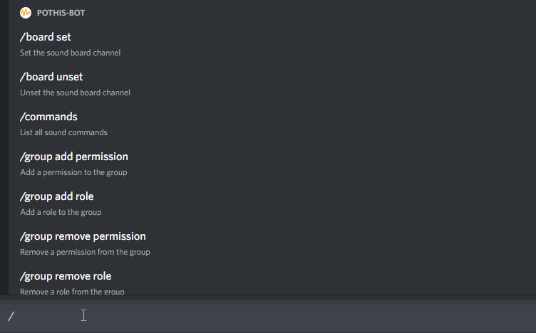

# Discord Sound Bot

This is a bot for the discord service. It allows users to create short sound clips, that can be played by command in a vouce channel.\
It offers highly customizable permission settings and many slash commands to interact with it. There also is a website that can be hosted to interact with the bot [here](https://github.com/p0thi/discord-bot-website).
## Features

- Create/delete Sounds per Guild
- Play sounds in a voice channel (specific or random)
- Set the volume for a guild
- Show a help message
- Ban users from using the bot
- Set a Sound to play whenever the user joins a voice channel
- download a sound file
- Create permission groups with different permissions:
    - Max amount of sounds per user
    - Max sound duration per sound
    - Permission to manage permission groups
    - Permission to manage Guild settings
    - Permission to ban users from using the bot
    - Permission to delete sounds of other users
    - Permission to add sounds
    - Permissin to play sounds
    - Permission to use a join sound
- Link permission groups to discord groups
- Select a text channel as a sound board, where the bot posts every sound as a button to play it.
- Provides a REST API to controll the bot (Used by the website)




## Deployment

Bevore the bot can work, there has to be an `bot.env` file created, that contains all required info for the bot to run. An example file can be found [here](.env.example).
There also has to be a MongoDB instance up and running. The connection URL to that instance also can be set in the `bot.env` file.\
The easiest way to deploy the bot and the website is with [docker compose](https://docs.docker.com/compose/). An example `docker-compose.yml` file can be found [here](docker-compose.yml).

It is recomendet to use yarn as a packet manager. Node 16 is required to run this code.\
The following steps show how to run the code locally:

Install the dependencies:
```bash
  yarn install
```

Run bot:
```bash
  yarn start
```

Run bot in production mode:
```bash
  yarn prod-start
```
